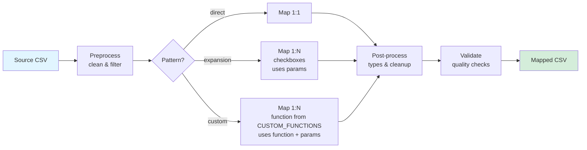

# Core Framework

Generic, reusable components for PCGL data mapping. No study-specific code allowed here.

## Structure

```
core/
├── mappers/
│   ├── base.py              # EntityMapper & StudyDataMapper classes
│   ├── utils.py             # Field mapping & transformation utilities
│   └── record_transforms.py # Record-level transformations
└── validators/
    ├── yaml_validator.py    # YAML config validation
    └── compare_*.py         # Data comparison tools
```

## Mapping Pipeline



**Pipeline Details:**

1. **Preprocess** - Clean and filter source data
   - Data cleaning: `clean_numeric`, `strip_whitespace`, `uppercase/lowercase`
   - Row filtering: eligibility criteria, REDCap baseline/repeat instruments, field filters
   - YAML config: `preprocessing`, `filters`

2. **Map Fields** - Transform source to target schema
   - Pattern: Direct (1:1) for most entities, Expansion (1:N) for checkboxes, Custom (1:N) for complex transformations
   - Transforms: value mappings, age/duration calculation, ID generation, date formatting
   - Custom functions: execute study-specific logic from CUSTOM_FUNCTIONS
   - YAML config: `mappings`, `configs`

3. **Post-process** - Clean mapped data
   - Type conversion: nullable integers (`Int64`), dates
   - Field cleanup: remove null required fields, apply conditional rules
   - Record filtering: additional filters on mapped data
   - YAML config: `post_processing`

4. **Validate** - Quality checks 
   - Required fields, age ranges, unique IDs, participant ID formats
   - Errors logged but don't stop processing
   - YAML config: `validations`

5. **Output** - Generate results
   - CSV export, statistics tracking, summary reports

## Key Classes (base.py)

### MappingConfig
Parses YAML entity config files into Python objects for use by EntityMapper.

**Features:**
- Loads and validates YAML structure (entity, mappings, configs, filters, etc.)
- Combines base and extension schema fields into single field list
- Provides typed access to all config sections
- Supports both direct and expansion mapping patterns
- Factory method `from_yaml()` for easy loading

**Usage:** Load from YAML file, then pass to EntityMapper.

```python
# Load config from YAML
config = MappingConfig.from_yaml('studies/MyStudy/config/participant.yaml')

# Access config properties
print(config.entity_name)      # 'Participant'
print(config.pattern)          # 'direct' or 'expansion'
print(config.entity_fields)    # ['submitter_participant_id', 'study_id', ...]
print(len(config.mappings))    # number of field mappings

# Pass to mapper
mapper = EntityMapper(config, study_id='MyStudy')
```

### EntityMapper
Maps a single entity from source data to PCGL schema using YAML configuration.

**Features:**
- Three patterns: Direct (1:1), Expansion (1:N checkboxes), Custom (1:N via user function)
- Field transforms: value mappings, calculated ages/durations, ID generation, date formatting
- Checkbox handling: aggregate into single field or expand to multiple records
- REDCap support: baseline/repeat filtering, field merging for longitudinal data
- Custom functions: integrate study-specific logic via CUSTOM_FUNCTIONS dict
- Extensible: override `preprocess()`, `postprocess()`, or other methods for complex needs

**Usage:** `map(source_df)` runs the full pipeline and returns mapped DataFrame.

```python
config = MappingConfig.from_yaml('participant.yaml')
mapper = EntityMapper(config, study_id='MyStudy')
result = mapper.map(source_df)
```

### StudyDataMapper
Orchestrates processing for an entire study by auto-discovering and running all entity mappers.

**Features:**
- Auto-discovers YAML configs in `studies/{study_id}/config/*.yaml`
- Loads custom mappers from `studies.{study_id}.mappers` if available (falls back to default EntityMapper)
- Imports CUSTOM_FUNCTIONS for study-specific transforms
- Processes all entities in sequence
- Collects results and generates summary statistics

**Usage:** Point it at a study directory and call `process_all()` with source data.

```python
mapper = StudyDataMapper(study_id='HostSeq')
results = mapper.process_all(source_df, output_dir='data/mapped')
# results is dict: {'participant': df, 'diagnosis': df, ...}
```

## Record Transformations (transforms.py)

Pure functions that transform individual records (dicts). Used by EntityMapper during field mapping.

- `apply_value_to_record()` - Copy or map field values
- `apply_age_to_record()` - Calculate age in days
- `apply_duration_to_record()` - Days between dates  
- `apply_identifier_to_record()` - Generate unique IDs
- `apply_date_to_record()` - Format dates to YYYY-MM-DD
- `apply_integer_to_record()` - Convert to nullable Int64
- `apply_note_to_record()` - Aggregate text fields

## Utilities (utils.py)

Low-level helpers used by mappers and transforms:

**Date/Time:**
- `calculate_age_in_days()`, `format_date_to_pcgl()`, `calculate_duration_in_days()`

**Values:**
- `_map_field_value()` - Apply value mappings with multi-field support

**IDs:**
- `generate_record_id()`, `validate_participant_id()`, `validate_age_in_days()`

**Type conversion:**
- `convert_nullable_int_columns()` - Auto-detect and convert age/duration fields to Int64
- `clean_numeric_string()`, `safe_int_conversion()`

**Logging:**
- `log_mapping_summary()`


